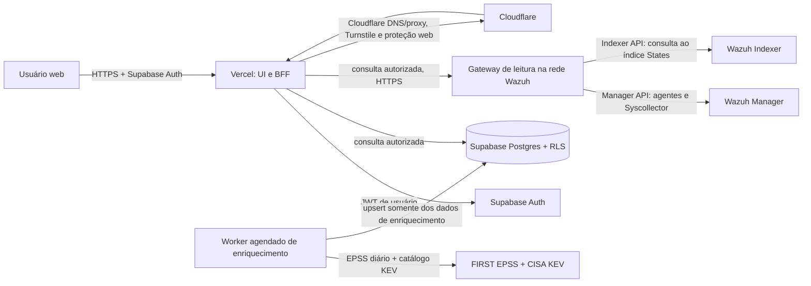

# Arquitetura escalável e roadmap do PUS PIER360

## Premissas de trabalho

- Frontend web multi-tenant hospedado em Vercel; Next.js/TypeScript é uma escolha recomendada, não uma decisão já implementada.
- Supabase Auth e PostgreSQL armazenam usuários, tenancy, permissões, workflow operacional e auditoria; não são a fonte padrão das vulnerabilidades consultadas.
- Wazuh continua sendo a origem de status/ativos e de vulnerabilidades. Vulnerabilidades são consultadas ao vivo no índice States do Indexer.
- V1 é leitura do Wazuh. Nenhuma ação de remediação/remoto é enviada ao Manager.
- Uma API externa do PIER360 é evolução pós-V1. A fundação da V1 deve preservar a separação entre interface/BFF e regras de negócio para permitir essa evolução sem trocar a arquitetura nem atrasar a entrega atual.
- “Ao vivo” significa consulta ao estado indexado no momento de cada requisição autorizada; a atualização depende da cadência de coleta/processamento/indexação do Wazuh. Mostrar o horário e o resultado da consulta.

## Arquitetura proposta

O browser nunca acessa Manager API (55000) ou Indexer API (9200). Para manter consultas de vulnerabilidade ao vivo sem expor essas APIs, hospede um gateway de leitura na rede Wazuh e permita que o BFF Vercel o alcance por conectividade privada ou Cloudflare Tunnel protegido por autenticação de serviço/Access. O gateway aceita somente operações tipadas e fixas (agentes/status, Syscollector packages e busca/aggregations no padrão de vulnerabilidades permitido); não aceite URL, DSL ou índice arbitrário enviado pelo browser. Credenciais Wazuh ficam no gateway, com usuários/roles somente leitura e TLS validado. Não use `curl -k`/desative validação de certificado em produção. A topologia, latência e compatibilidade Vercel-gateway devem ser validadas no ambiente de descoberta.

### Fluxo de dados

1. O usuário autentica e o BFF resolve tenant/conexão e permissões no servidor. O browser nunca escolhe conexão ou cluster fora desse escopo.
2. A cada consulta de agente, o BFF chama o gateway, que usa `GET /agents/summary` para contagens, `GET /agents` para lista/ficha e, somente ao abrir a ficha, `GET /syscollector/{agent_id}/packages` com seleção segura de `scan.time`. `GET /agents/summary/status` não é o endpoint dos cartões de distribuição.
3. A cada consulta de vulnerabilidade, o gateway executa no Indexer uma busca/aggregation limitada no índice `wazuh-states-vulnerabilities-*`; o BFF acrescenta overlay operacional de workflow do Supabase para os IDs retornados.
4. Dashboard, lista e detalhe usam a mesma fonte e filtros sem carregar todo o índice no cliente. Paginação/aggregations ocorrem no Indexer; a resposta informa hora da consulta e erro/timeout/shard parcial.
5. A resposta ao vivo não é persistida como snapshot no Supabase. Metadados mínimos de execução (duração, resultado, quantidade, erro sanitizado) podem ser registrados para operação, sem payload de finding.
6. O worker agendado atualiza catálogos EPSS e KEV separadamente da leitura de tela. Ele consulta/agrega as CVEs presentes no Indexer, faz o cruzamento em lote e grava somente dados de enriquecimento e metadados de execução.
7. O BFF junta cada finding Wazuh ao enriquecimento mais recente pela CVE. Se a fonte falhar ou o enrichment estiver antigo, conserva o último dado válido com sua data e sinaliza o estado; a consulta live ao Wazuh continua independente.
8. O estado de tratamento, comentários, responsáveis e aceite de risco existe no PUS e referencia a identidade estável do finding, sem reescrever o estado do Wazuh.
9. A classificação do ativo como crítico é um overlay operacional binário do PUS, identificado por tenant + conexão Wazuh + agent. Ela não atribui pontos nem altera o score de risco; na V1, permanece na lista/ficha de ativos e como contexto na tabela de ativos impactados, sem cartão dedicado no dashboard.
10. Priorização e métricas usam um classificador único por tenant: itens do KEV vêm primeiro; os demais seguem EPSS válido em ordem decrescente. O corte padrão é 0,088 (inclusivo); a interface destaca KEV ativo, EPSS no corte e a interseção KEV + EPSS no corte. EPSS abaixo continua na fila e sem score fica pendente. Não entram pesos de CVSS/severidade/criticidade do ativo.
11. Dashboard, lista, detalhe, filtros e navegação consomem um mesmo modelo por tenant; a aplicação não mantém fórmulas paralelas em cada tela. Configuração ou classificação alterada no PUS recalcula as métricas derivadas na próxima leitura da UI.

### Dados e limites de domínio

| Entidade | Responsabilidade |
|---|---|
| `tenants` | Organização/cliente e configuração de apresentação. |
| `wazuh_connections` | Tenant, cluster, versão, estado da conexão e referências a secrets; nunca senha/token em texto no banco de leitura. |
| `profiles` | Identidade de aplicação ligada ao `auth.users`, estado de acesso e preferências. |
| `tenant_memberships` | Relação usuário-tenant. Permite evoluir para usuário em vários tenants sem mudar permissões de módulo. |
| `user_module_permissions` | `user_id`, `tenant_id`, módulo e capability (por exemplo read/manage); acesso negado se faltar grant. Super admin é capability global protegida. |
| `agents` | Não persistido como fonte operacional padrão na V1; respostas atuais vêm da Manager API. Criar cache/projeção apenas se uma decisão futura exigir e mostrar sua idade. |
| `asset_classifications` | Overlay PUS por `tenant_id`, `source_connection_id` e `source_agent_id`, com `is_critical` booleano; registrar ator/horário das mudanças na auditoria. Não contém pontuação. |
| `tenant_vulnerability_priority_configs` | Uma configuração por `tenant_id`, com `epss_threshold` decimal (padrão `0.088`), `updated_by` e `updated_at`; mudança restrita ao super admin/capability de gestão e auditada. KEV tem precedência fixa definida pelo produto. |
| `vulnerability_findings` | Não persistido como fonte de leitura padrão. Resposta atual vem de `wazuh-states-vulnerabilities-*`; confirmar ID de documento/chave estável para associar overlays. |
| `vulnerability_enrichment` | Uma linha por CVE com EPSS, percentile, data do score, membership/atributos CISA KEV, fonte e data de atualização. Não contém cópia dos findings Wazuh. |
| `vulnerability_work_items` | Status operacional do PUS, responsável, prazo, justificativa de risco aceito e comentários. Referencia conexão + identidade estável do finding. |
| `source_query_runs` | Domínio consultado, início/fim, duração, quantidade, sucesso/timeout/parcial/falha e código sanitizado; sem copiar payload sensível. |
| `enrichment_runs` | Fonte EPSS/KEV, início/fim, data efetiva do conjunto, quantidade aplicada, sucesso/falha e erro sanitizado. |
| `audit_log` | Ator, tenant, ação, alvo, horário e valores essenciais de alterações de permissão/workflow, sem registrar secrets. |

Aplicar `tenant_id` a toda linha de domínio e RLS a todas as tabelas acessíveis pela API. Criar funções/policies para validar membership e capability sem permitir que o usuário altere suas próprias grants. Guardar listas de módulos/capabilities numa tabela normalizada; não usar apenas JSON no perfil como mecanismo de autorização. O secret/service key do Supabase ignora RLS e fica somente em funções server-side/conector, com operações estreitas e auditadas. A classificação crítica é editável apenas por usuário autorizado no detalhe do ativo e deve ser gravada junto a tenant/conexão/agent para não cruzar ambientes ou clientes.
Configuração EPSS deve usar tenant como chave/RLS, capability de super admin para atualização, limite validado entre 0 e 1 e registro de auditoria de valor anterior/novo.

### Autenticação e borda

- Sem cadastro público. Super admin convida usuários por e-mail através de função server-side Supabase Auth Admin; não definir senhas temporárias nem expor a Admin API no browser.
- Turnstile no login, convite/aceite e recuperação conforme risco. Supabase Auth aceita Cloudflare Turnstile com campo `captchaToken`; sempre exigir validação server-side e rejeitar token inválido/expirado.
- MFA TOTP obrigatório para todos os usuários em produção; bloquear páginas e APIs protegidas quando a sessão ainda está em AAL1. Super admin também deve usar TOTP e ações de privilégio entram no log.
- Rate limit de autenticação e do gateway de leitura, cookies/sessões seguras, CSP, proteção CSRF quando aplicável, CORS restrito ao domínio e mensagens de erro que não revelem existência de contas.
- Cloudflare pode aplicar DNS/proxy e proteções web; Turnstile é uma camada anti-bot, não substitui MFA, RLS, autorização, WAF ou proteção do endpoint Wazuh.

## Estratégia de escalabilidade

1. **Executar leituras seletivas e ao vivo.** Pedir agregações diretamente ao Indexer, retornar somente campos necessários, paginar findings com cursor/PIT/search_after conforme suporte e limitar tamanho/tempo de consulta. Não descarregar o índice para o browser.
2. **Controlar concorrência e pressão no Wazuh.** Aplicar timeout, rate limit por conexão/tenant, coalescência de requisições idênticas e backoff para 429/5xx. Dashboard deve usar consultas agregadas, não uma chamada por finding.
3. **Medir antes de cachear.** Instrumentar latência p50/p95, tempo de Indexer, erros, resultados parciais, tráfego e carga por tenant. O padrão V1 é sem cache persistente de findings; um cache curto pode ser adicionado depois, com carimbo de atualização visível e prazo aprovado.
4. **Paginar workflow no Supabase.** Indexar `vulnerability_work_items` em `(tenant_id, source_connection_id, finding_key)`, aplicar RLS e buscar overlay em lote para a página corrente.
5. **Juntar enrichments por lote.** A chave é CVE, portanto uma entrada serve para vários findings/agentes. Em dashboard, agregar findings atuais no Indexer por CVE e cruzar com a tabela EPSS/KEV no servidor; não fazer chamada externa por finding nem baixar todo o índice no browser.
6. **Separar gateway da UI e scheduler.** Gateway sem estado para consultas Wazuh e worker agendado para fontes externas, ambos com autenticação de serviço, limites e observabilidade. Adicionar réplicas/filas somente após medir concorrência e custo.
7. **Evoluir os módulos por capability.** Próximos módulos (alertas, Hardening, CTI) entram com tabelas, rotas e permissões próprias, mantendo visão/branding compartilhados e sem ampliar privilégios do usuário automaticamente.

## API externa do PIER360 — evolução pós-V1

A V1 não publica uma API de integração para clientes externos. A interface usa o BFF para acessar serviços server-side; o navegador não acessa diretamente o Wazuh nem recebe credenciais privilegiadas. Para evitar retrabalho, as operações de domínio devem ficar em serviços reutilizáveis: o BFF da interface e uma futura API versionada poderão chamar os mesmos casos de uso e o mesmo classificador de vulnerabilidades. Assim, filtros, permissões, tenancy e workflow terão uma única fonte de regra.

A construção da API será uma fase independente após estabilizar os contratos de agentes, vulnerabilidades e workflow da V1. Antes de abrir o primeiro endpoint externo, definir OpenAPI/versionamento, identidades de integração separadas de usuários humanos, escopos por tenant/módulo, emissão/rotação/revogação de credenciais, rate limits, paginação, idempotência para escritas e auditoria que identifique o principal humano ou integração. Mudanças de banco necessárias nessa fase serão entregues por migrations versionadas; não são pré-requisito do Gate 2.8 nem da integração de leitura da V1.

Evoluir a API por capacidades: (1) consultas de leitura de ativos e vulnerabilidades; (2) escrita limitada ao workflow do PUS, como atribuições e mudanças de tratamento; (3) ações sobre sistemas externos, como remoção de agente no Manager, somente em uma etapa separada com autorização explícita, credencial de menor privilégio, operação assíncrona, identificador/idempotência, auditoria, retries e reconciliação de estado. Uma falha entre PIER360 e Manager não deve ser apresentada como operação concluída. O PIER360 não apaga diretamente documentos do índice States; mantém o histórico e reconcilia os dados de origem segundo política de retenção aprovada.

Esta evolução não altera o escopo, o cronograma nem o Gate A/B da V1. O princípio de serviços de domínio compartilhados evita uma reestruturação posterior; os endpoints, credenciais de integração e ações de escrita só serão construídos após aceite de escopo próprio.

## Plano de desenvolvimento

O cronograma detalhado, as premissas de equipe, os gates de aprovação e os dois workflows da V1 estão em [Cronograma faseado e workflow](./cronograma-e-workflow-v1.md).

A Fase 2 foi dividida em subfases de ambiente, tenancy, RLS, Auth/MFA/Turnstile, autorização server-side, auditoria e gate de segurança em [Fundação do backend](./fase-2-fundacao-backend.md).

| Fase | Entrega | Saída para avançar |
|---|---|---|
| 0. Descoberta técnica | Confirmar versões/topologia Wazuh, volumes, cadência, conectividade, região e contas/plano. Aprovar semântica de `lastKeepAlive`, detecção, último scan, resolução e tenancy. | Acesso a ambiente de teste Wazuh e contrato de dados assinado pelo responsável técnico. |
| 1. Fundação | Projeto, pipelines, migrations, tenancy, Auth, sessão, RLS, convite, permissões por módulo, audit log e design tokens claro/escuro. | Testes de isolamento tenant e MFA/captcha aprovados. |
| 2. Agentes | Gateway read-only Manager API, resumo de status, busca/lista, ficha e consulta Syscollector para scan de inventário. | Totais reconciliados; lastKeepAlive separado de scan.time; latência/erros visíveis. |
| 3. Vulnerabilidades ao vivo | Gateway Indexer API com leitura do índice States, agregações/paginação, dashboard, lista/filtros, detalhe e workflow/comentários PUS. Classificador único KEV → EPSS com corte ajustável por tenant. | Coerência entre dashboard/lista/detalhe; KEV precede EPSS em todas as telas; resposta atual consultada; carga/latência e acesso testados. |
| 3.1 Enriquecimento EPSS + KEV | Importação agendada de EPSS diário e catálogo JSON CISA KEV; normalização por CVE; atualização da tabela de enrichment; junção server-side em dashboard/lista/detalhe; estados de frescor/ausência/falha. | CVEs Wazuh cruzadas; data e fonte exibidas; falha não zera score nem altera membership KEV; dashboard e filtro KEV/EPSS reconciliados. |
| 4. Super admin e acabamento | Gestão de usuário, tenant, módulos e status; auditoria de privilégios. | Papéis e alterações auditados; nenhuma permissão apenas de frontend. |
| 5. UI/UX com dados reais | Sessões curtas com analistas e gestores usando staging: validar rótulos, ordem KEV/EPSS, densidade das tabelas, busca/filtros, estados vazios/erro, leitura em telas menores, contraste e teclado. Corrigir itens priorizados antes do UAT. | Fluxos principais compreendidos sem orientação; fila sem rolagem horizontal; métricas e filtros com nomes consistentes; acessibilidade e responsividade aprovadas. |
| 6. QA e UAT | Regressão funcional, segurança/autorização, reconciliação de dados com Wazuh, evidências e aceite de usuários representativos. | Casos bloqueantes aprovados e divergências de origem resolvidas. |
| 7. Preparação e go-live | Staging, migrações, backup/restore, schedules/alertas, runbooks, observabilidade e piloto. | Gate de produção da [estratégia de testes](./plano-de-testes.md) e [plano de produção](./plano-de-producao.md) aprovado. |

### Agenda inicial dos enrichments

- **EPSS:** importar o CSV completo uma vez ao dia após a publicação diária da FIRST (janela inicial sugerida: 14:30 UTC / 11:30 BRT); cruzar e persistir somente CVEs presentes nos findings atuais do Wazuh. A FIRST recomenda CSV para acesso em lote; a API fica para lookup de pequenos lotes/recuperação pontual.
- **CISA KEV:** atualizar o catálogo JSON a cada 6 horas e aplicar upsert/diff por CVE. Persistir data de inclusão, prazo/ação e atributo de ransomware quando presentes.
- **Execução:** usar scheduler/worker do gateway ou serviço dedicado fora dos Vercel Cron Hobby; manter retries com backoff, última execução bem-sucedida e alerta de fonte atrasada. Se a rotina falhar, conservar os dados anteriores marcados com a data antiga; findings Wazuh continuam sendo consultados ao vivo.
- **Dashboard:** aplicar filtros KEV/EPSS no backend combinando findings/agregações atuais do Indexer com a tabela de enrichment. Entradas sem CVE, score ou atualização válida aparecem como “indisponível/pendente”, sem atribuir score 0 ou KEV falso por falha de ingestão.

## Evolução posterior

- **V1.1:** alertas Wazuh com busca/triagem, eventos de resolução e contexto de investigação.
- **V1.2:** hardening/CIS e agregações por baseline.
- **V1.3+:** módulo CTI e integrações externas, com cadastro de fontes e políticas de dados próprias.
- **API externa do PIER360 (fase pós-V1, independente):** especificar contrato OpenAPI, versionamento, identidades máquina-a-máquina e escopos por tenant; começar com leitura de ativos/vulnerabilidades; depois habilitar escrita do workflow PUS com idempotência e auditoria. Ações externas no Manager, como remover agente, ficam para uma etapa posterior própria com execução assíncrona, autorização explícita, retries e reconciliação. As telas e a futura API compartilham os mesmos serviços e regras de negócio.
- Revisar limites de plano/custo e contratos de dados antes de introduzir cada módulo. Não habilitar alertas, ações de resposta ou APIs de escrita como efeito colateral da integração V1.
- A API externa não entra nos 10 dias da apresentação, não bloqueia o Gate A/B e não muda a integração Wazuh somente leitura da V1. A preparação limita-se a manter a camada de domínio separada do BFF; endpoints, credenciais de integração e migrations específicas serão planejados e aceitos na fase futura.
- Repetir a revisão UI/UX em cada módulo novo, com protótipo validado por usuários antes de ampliar permissões ou iniciar o desenvolvimento integrado.

## Referências oficiais da plataforma

- [Wazuh: API de agentes](https://documentation.wazuh.com/current/user-manual/api/reference.html), [Indexador e consulta de vulnerabilidades](https://documentation.wazuh.com/current/user-manual/indexer-api/use-case.html)
- [FIRST EPSS: dados/API e recomendação de CSV para lote](https://www.first.org/epss/data), [CISA Known Exploited Vulnerabilities Catalog (CSV/JSON)](https://www.cisa.gov/known-exploited-vulnerabilities-catalog)
- [Supabase: RLS](https://supabase.com/docs/guides/database/postgres/row-level-security), [MFA](https://supabase.com/docs/guides/auth/auth-mfa), [convidar usuário](https://supabase.com/docs/reference/javascript/auth-admin-inviteuserbyemail)
- [Turnstile no Supabase Auth](https://supabase.com/docs/guides/auth/auth-captcha), [validação server-side Turnstile](https://developers.cloudflare.com/turnstile/get-started/server-side-validation/)
- [Vercel Hobby](https://vercel.com/docs/plans/hobby), [limites de Cron](https://vercel.com/docs/cron-jobs/usage-and-pricing), [Supabase Free e preços](https://supabase.com/pricing), [pausa de projetos Free](https://supabase.com/docs/guides/platform/free-project-pausing)
